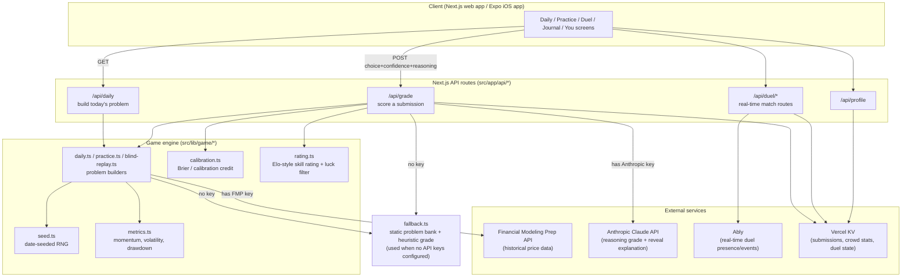

<p align="center">
  
</p>

<h1 align="center">Hindsight</h1>

<p align="center">
  Wordle energy. Chess.com grading. Luck doesn’t get you the rating.
</p>

<p align="center">
  <a href="https://hindsight-one.vercel.app">Live</a>&nbsp;·&nbsp;<a href="https://github.com/rsheth8/Hindsight">Source</a>&nbsp;·&nbsp;<a href="CONTRIBUTING.md">Run locally</a>
</p>

<p align="center">
  
  
</p>

<p align="center"><sub>Runs with zero API keys. Optional FMP + Anthropic for the full loop.</sub></p>

---

## What this is

Every day, Hindsight shows you an anonymized slice of a real stock's price history — a chart with the ticker hidden, plus a handful of technical stats (trend, volatility, distance from its high, etc.). You're asked one question: over the next three months, will this stock **gain more than 10%**, **stay roughly flat**, or **fall more than 10%**?

You pick an answer, say how confident you are (a slider from "coin flip" to "certain"), and write a short thesis explaining your reasoning. Hindsight then reveals what actually happened and grades you — not just on whether you were right, but on:

1. **Were you well-calibrated?** If you said "90% sure" and were wrong, that hurts a lot more than if you said "55% sure" and were wrong. If you said "90% sure" and were right, that's rewarded.
2. **Was your reasoning any good?** An AI reads your thesis and checks whether you actually used the evidence on screen, considered the other side, and said what would change your mind — versus just guessing or vibing.
3. **Were you just lucky?** If you picked the right answer but your reasoning was weak, Hindsight deliberately caps how much your rating can go up. Being right for the wrong reasons doesn't build your rating.

Over time this produces a skill rating (Elo-style) that's much harder to game with luck than a simple win/loss score — the whole point is to reward *judgment and calibration*, the transferable skills, rather than one-off correct guesses. There's a daily streak, a personal journal of every past call, and a shareable result card, in the spirit of Wordle.

There's a web app (Next.js) and a native iOS app (Expo/React Native) that both talk to the same backend.

## Key features

- **Daily problem** — one anonymized real-market setup per day, seeded by date so everyone sees the same puzzle.
- **Three-part grading** — outcome correctness (15%), calibration/Brier score (45%), AI-graded reasoning quality (40%). Outcome is deliberately the smallest weight because a single 3-month stock move is mostly noise.
- **Luck filter** — a correct call backed by weak reasoning has its rating gain clamped toward zero ("right for the wrong reasons").
- **Provisional rating window** — under 10 graded calls, a beginner's rating moves faster (higher K-factor) and thin reasoning can't sink it, only lift it.
- **Reveal & coach** — after grading, you see the real ticker, what happened, an AI-written explanation at your chosen depth (Learn / Analyst / Quant), and how the "crowd" answered.
- **Additional modes** — Practice (drill by focus area), Blind Replay (progressively reveal a chart), special problem types (spot-the-flaw, options-greeks, futures-basics, calibration-bet), and a real-time head-to-head Duel mode.
- **Journal & profile** — every graded call is logged locally (and to a server profile) so you can see your rating trajectory, streak, and where you're strong or leaking edge.
- **Graceful degradation** — with no API keys configured, the app still runs end-to-end using a built-in fallback problem bank and a heuristic (non-AI) grader, so it's always demoable.
- **Native iOS client** — an Expo/React Native app that reuses the same game logic and talks to the Next.js app as its backend over HTTPS.

## How it works

**Step by step, for the core Daily loop:**

1. **Problem generation** (`GET /api/daily`): the server picks a date-seeded random ticker from a curated large-cap universe, fetches its historical daily closes from the Financial Modeling Prep API, and picks a "decision date" in its history with roughly 6 months of visible chart behind it and a resolved 3-month-forward outcome ahead of it. Decision dates are chosen so the true answer (gain / flat / fall) is balanced roughly evenly across A/B/C over time — without this, the game would just reward always picking "gained," since large-cap survivors trend up on average.
2. **Anonymization**: the price series is re-indexed so it always starts at 100, and the ticker/company name are stripped from the response the client receives — only the shape of the chart and a few computed metrics (momentum, volatility, drawdown, distance-from-high) are sent.
3. **The call**: the player picks A/B/C, sets a confidence level, picks reasoning chips and/or writes a free-text thesis, and submits.
4. **Grading** (`POST /api/grade`): the server re-derives (or re-fetches, for practice/duel/special modes) the same solved problem so the client never held the answer. It computes:
   - `correct` — did the choice match the true forward-return bucket?
   - `brier` — `(confidence − outcome)²`, the calibration penalty.
   - `reasoning` — an Anthropic Claude call grades the free-text thesis 0–1 against a fixed rubric (cites evidence? weighs the counter-thesis? states what would change their mind?); falls back to a keyword heuristic if no API key is set.
   - A weighted skill score `S = 0.15·correctness + 0.45·calibration + 0.40·reasoning`, compared against an Elo-style "expected score" `E` derived from the problem's estimated difficulty, to produce a rating delta `R' = R + K·(S − E)`.
   - The luck filter clamps the rating gain when the player was correct but the reasoning score was weak.
5. **Reveal**: the real ticker, company, and what happened are returned, along with an AI-written explanation tailored to the player's chosen depth (Learn/Analyst/Quant), and a crowd-answer distribution (real once enough submissions exist for that problem, otherwise a labeled illustrative estimate).
6. **Persistence**: if the player has a device ID, the submission (choice, confidence, correctness, brier, reasoning score, rating delta) is saved server-side (Vercel KV in production) for crowd stats and cross-device profile sync; the client also keeps a local profile/journal.
7. **Other modes** reuse the same building blocks: Practice pulls from the same problem generator with a focus filter; Blind Replay reveals the chart in stages; special problem types (options-greeks, futures-basics, spot-the-flaw, calibration-bet) are separate synthetic generators graded through the same rating pipeline; Duel is a real-time two-player race (via Ably) where both players solve the same problem and compare scores.



## Tech stack

- **Web app**: Next.js 16 (App Router), React 19, TypeScript, Tailwind CSS v4.
- **Native app** (`mobile/`): Expo SDK 56, React Native 0.85, TypeScript — a thin client that duplicates the pure game logic from `src/lib/game/` and calls the Next.js app as its backend over HTTPS.
- **Data**: [Financial Modeling Prep](https://financialmodelingprep.com/) `/stable/` REST API for historical daily price bars (server-side only).
- **AI**: Anthropic Claude Messages API for reasoning grading and reveal explanations (server-side only), with a deterministic heuristic fallback when no key is configured.
- **Real-time**: Ably for Duel mode presence and match events.
- **Storage**: Vercel KV (Redis-compatible) for submissions, crowd statistics, and duel match state in production.
- **Testing**: Vitest (unit/API tests), Playwright (E2E smoke and journey tests).
- **Tooling**: ESLint 9, TypeScript 5.

## Project structure

```
src/
  app/                  Next.js App Router pages and API routes
    api/daily           GET today's problem (answer stripped)
    api/grade           POST a submission → grade + reveal
    api/practice         GET/POST practice-mode problems
    api/blind-replay     progressive-reveal mode
    api/duel/*           real-time head-to-head match routes
    api/profile          cloud profile sync
    daily, practice, journal, rank, you, ...   page routes
  components/            React UI components (DailyGame, ShareCard, DuelView, ...)
  lib/
    game/                 core game engine, pure functions, fully unit-tested
      daily.ts · practice.ts · blind-replay.ts · special-problems.ts   problem builders
      calibration.ts · rating.ts                                       scoring math
      metrics.ts · seed.ts · universe.ts · fallback.ts                 supporting data/utils
    fmp/client.ts          Financial Modeling Prep client (server-side only)
    ai/                    Anthropic client + grading/explanation prompts
    db/                    submissions + duel state (KV-backed) stores
    duel/                  real-time duel client/service helpers
    profile/               local profile store + React hook
mobile/
  App.tsx, src/screens/*   Expo/React Native screens mirroring the web app
  src/lib/game/*           duplicated copy of the web game engine (kept in sync manually)
e2e/                      Playwright end-to-end specs
docs/                     design system, product handoff, testing, and launch docs
scripts/check-game-sync.sh   verifies src/lib/game and mobile/src/lib/game haven't drifted
```

## Setup / running locally

**Web app** (from the repo root):

```bash
npm install
npm run dev      # → http://localhost:3000 (redirects to /daily)
```

The app works with **zero configuration** — it uses a built-in fallback problem bank and a heuristic grader. For the full experience (live market data + AI grading), set:

```bash
cp .env.local.example .env.local
# FMP_API_KEY        — Financial Modeling Prep API key (/stable/ endpoints)
# ANTHROPIC_API_KEY   — Claude API key, used for reasoning grading + reveal explanations
```

Both keys are server-side only and never reach the client bundle.

**Native iOS app** (`mobile/`) — the Next.js app is its backend:

```bash
npm run dev                    # backend + web, localhost:3000
cd mobile && npx expo start    # then press "i" for the iOS simulator
```

**Other scripts:**

```bash
npm run build           # typecheck + production build
npm test                # Vitest unit + API tests
npm run test:coverage   # Vitest with HTML coverage report
npm run test:e2e        # Playwright E2E against a production build
npm run test:ci         # lint + coverage + game-sync check + build (full CI suite)
curl localhost:3000/api/health   # reports which backends are live vs. fallback
```

See `docs/TESTING.md` for the full testing regime and `docs/app-store-checklist.md` for iOS shipping steps.

## Notable implementation details / design decisions

- **The rating is the product.** `src/lib/game/rating.ts` implements an Elo-style update where the "opponent" is the problem's estimated difficulty, and the score being compared isn't correctness alone but a weighted blend of correctness (15%), calibration (45%), and AI-graded reasoning (40%). This is documented in detail in `docs/handoff.md` and `CLAUDE.md`.
- **Luck filter.** A correct answer with weak reasoning (`reasoning < 0.4`) has its skill score clamped to `min(score, 0.5 + reasoning·0.25)` — so guessing right without a real thesis barely moves the rating.
- **Calibration math is single-sourced** in `src/lib/game/calibration.ts` (confidence floor of `1/3`, Brier reference of `2/9`) — the rest of the codebase always calls `calibrationCredit`/`calibrationSkill` rather than re-deriving the formula, per `CLAUDE.md`.
- **Answer-distribution balancing.** Because the live universe (`src/lib/game/universe.ts`) is large-cap stocks that tend to survive and trend upward, `daily.ts` deliberately searches for a decision date whose 3-month-forward outcome matches a seed-rotated target class (A/B/C), so the correct answer is roughly evenly distributed and the game can't be beaten by always picking "gained."
- **Total-return outcomes.** Both the visible chart and the graded outcome use dividend/split-adjusted close (`adjClose`) when the API provides it, so the two stay internally consistent and the game doesn't (falsely) claim survivorship-free data.
- **Everything degrades gracefully.** `hasFmpApiKey()`/`hasAnthropicKey()` gate every external call; without keys, `fallback.ts` supplies a small static problem bank and a heuristic grader so the app always runs, demos, and tests cleanly.
- **Educational-only guardrails.** The system never generates buy/sell advice in UI copy or AI prompts — this is enforced as a standing rule in `CLAUDE.md`, not just documentation.
- **Mobile duplication, not sharing.** The pure game logic in `src/lib/game/` is copied (not symlinked or packaged) into `mobile/src/lib/game/` so the iOS app can ship independently; `scripts/check-game-sync.sh` checks the two haven't drifted, and it's part of `npm run test:ci`.
- **Server-authoritative grading.** The client never receives the answer before grading — `POST /api/grade` re-derives (or re-fetches) the same seeded problem server-side before comparing it to the submitted choice, so the puzzle can't be solved by reading client-side state.

## Contributing

PRs and issues welcome. How to run tests, env vars, and the expected layout: [CONTRIBUTING.md](CONTRIBUTING.md).

Don't commit `.env`, API keys, or personal recordings.

