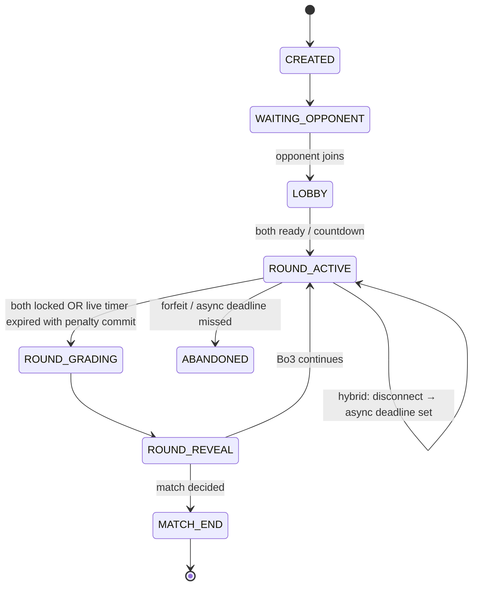

# Hindsight — Duels & head-to-head PvP (design note)

> **Status:** **V1 built** (Call & Counter, live/async/hybrid, REST-polling transport).
> Companion to `docs/leagues-design.md` (async cohort competition on the daily) and
> `docs/handoff.md` TODO #6 (accounts backend). Owner: Rahil. Drafted 2026-06-18.
>
> **What's shipped (this build):**
> - Pure engine `src/lib/game/duel.ts` (+ mobile mirror, in the sync check) — round
>   winner, duel Elo (separate ladder), Best-of-3 resolution. Unit-tested.
> - Match + queue store `src/lib/db/duel-store.ts` — Upstash/KV with local-file fallback.
> - Orchestration `src/lib/game/duel-service.ts` — create/matchmake, join, commit+grade
>   (reuses `gradeCall` → same calibration+reasoning+luck-filter as the daily), lazy
>   deadline expiry, hybrid live→async conversion, per-viewer serializer (no commit leaks).
> - API: `POST /api/duel/match`, `.../[id]` (GET), `.../[id]/{join,problem,commit,forfeit}`,
>   `GET /api/duel/realtime`.
> - Mobile **and web** clients: `mobile/src/lib/duel/*` + `src/lib/duel/*` (REST client +
>   polling match hook), `DuelScreen` / `DuelView` (lobby → matchmaking/challenge → live
>   round → head-to-head reveal), wired into the **Rank** tab/page; profile gains a
>   separate `duelRating` + `recordDuel`.
> - **Friendly handles + result explanation:** deterministic `duelName(deviceId)` ("Bullish
>   Otter") so players are distinguishable, and `explainRound()` powers a post-result "Why"
>   card (direction / calibration / reasoning breakdown). Both in the shared engine.
> - **AI opponents (cold-start fix):** `src/lib/game/duel-bot.ts` — a queue lobby with no
>   human fills with a rating-appropriate bot after `DUEL_BOT_FILL_MS` (default 4s). The bot
>   makes a real graded call (skill scales with rating, dragged by difficulty) scored by the
>   same `gradeCall` pipeline, and is always flagged `isBot` (🤖 in the UI). Friend
>   challenges never bot-fill. Server-side only (the phone never grades). Unit + service tested.
> - Identity is the existing anonymous device id; **Clerk accounts** and **Ably** live
>   sync are the next upgrades (the `/api/duel/realtime` route is the Ably seam).
>
> **Not yet built:** Ably live transport (V1 uses polling), Clerk accounts, and the arena
> modes (Argument Arena / Blind Bid / Contrarian / Live Ticker).

---

## The decision in one line

**Live-first head-to-head duels on identical setups, graded on judgment (calibration +
reasoning), with per-mode support for live, async, and hybrid tempo — using managed
realtime infra on top of the existing Vercel + Upstash stack, not a custom WebSocket
server.**

---

## Why duels fit Hindsight

- **It's the chess.com half of the pitch.** Leagues are macro PvP (you vs 25 others on the
  same daily). Duels are micro PvP (you vs one person, right now).
- **Structurally fair, like leagues.** Both players see the **same anonymized setup**. Nobody
  picks a different stock; nobody wins on fake P&L.
- **Reuses the moat.** Same `skillScore` + luck filter from `src/lib/game/rating.ts`, same
  reasoning rubric from `src/lib/ai/grade.ts`, same problem builder as Practice — just new
  match orchestration on top.
- **Mode variety = retention.** Different “game types” (Same Board, Best of 3, Argument
  Arena, …) give players agency without breaking competitive integrity.

## What we rejected, and why

- **Competing on returns / portfolio P&L.** Rejected — ChartGame territory; breaks the niche.
- **Different stocks per player.** Rejected — luck dominates; leagues become meaningless.
- **Self-hosted WebSockets on Vercel.** Rejected — serverless functions can't hold
  long-lived connections. Use a managed pub/sub provider (see §Infrastructure).
- **One global Elo for daily + duels.** Rejected — daily is the ritual; **Duel rating** is
  the arena. Cross-seed placement from Judgment rating is fine; keep ladders separate.
- **Fake human opponents in ranked.** Rejected — sparring bots are unrated and labelled.

---

## Core model: Mode × Tempo

Every PvP session is:

```
[Game mode]  ×  [Tempo: live | async | hybrid]
```

| Tempo | Player feel | Clock | Default for |
|-------|-------------|-------|-------------|
| **Live** | Both in the room; “opponent is thinking…” | Server timer (45s–3m per round) | Ranked queue |
| **Async** | Send your call; push when they respond | Deadline per round (24h default) | Friend challenges |
| **Hybrid** | Starts live; ghosts flip to async | Live timer → async deadline on drop | Ranked safety net |

**Hybrid rule (important at low density):** if a live round starts and a player disconnects
or times out without locking in, convert **that round** to async (`deadline = now + 24h`) and
notify both — don't instant-forfeit unless they abandon the whole match.

---

## Game mode catalog

Full roadmap. **V1 ships only the first row.**

| Mode | ID | Live | Async | Hybrid | Ranked | Notes |
|------|----|:----:|:-----:|:------:|:------:|-------|
| **Call & Counter** (Same Board) | `same-board` | ⭐ | ✓ | ✓ | Yes | **V1** — one setup, commit, reveal |
| **The Desk** (Best of 3) | `best-of-3` | ⭐ | ✓ | ✓ | Yes | Phase B — chess match format |
| **Argument Arena** | `argument-arena` | ⭐ | optional | rebuttal window | Yes | Phase C — commit + 30s rebuttal |
| **Blind Bid** | `blind-bid` | ⭐ | ✓ | ✓ | Yes | Phase D — conviction chips |
| **Contrarian Clash** | `contrarian` | ✓ | ⭐ | ✓ | Casual | Asymmetric roles; party queue |
| **Live Ticker** | `live-ticker` | only | — | — | Later | Sync replay clock; live-only |

**Clock presets (live):**

| Preset | Commit time | Use |
|--------|-------------|-----|
| Blitz Read | 45s | Quick queue |
| Rapid Read | 90s | **V1 default** |
| Deep Read | 3m | Unrated / learning |

**Async deadline:** 24h per round (configurable per challenge); 72h cap for full Best-of-3.

---

## Scoring & ratings

### Round winner (not “who was right”)

Both players are graded with the existing composite:

```
S = skillScore({ correct, brier, reasoning })   // 0–1, luck filter applied
```

**Round winner:** higher `S`. Tiebreakers: lower Brier → higher reasoning → draw (½ point in
Best of 3).

Outcome correctness is already down-weighted inside `S` (15%). Duels double down on judgment.

### Match winner

| Format | Win condition |
|--------|---------------|
| Same Board (Bo1) | Round winner |
| Best of 3 | First to 2 round wins |
| Argument Arena | Weighted: 70% commit `S` + 30% rebuttal grade |

### Duel rating (separate Elo)

- **Judgment rating** — solo daily + practice; unchanged.
- **Duel rating** — all ranked PvP. Same Elo math as `updateRating()`, but:
  - **Expected score** uses opponent's **duel** rating (not problem difficulty).
  - **Actual score** for the Elo update is match result: `1` win, `0.5` draw, `0` loss (not
    per-round `S` — keeps chess-like clarity).
- **Placement:** seed duel rating from Judgment rating on first ranked duel; provisional
  K-factor until 10 duel matches.
- **Gate:** no rated duels until ≥10 solo graded calls (same provisional gate as today).

---

## Infrastructure (use what's already out there)

Vercel serverless **cannot** host WebSockets. Don't fight it — compose managed services that
already solve match sync, and keep **authoritative state in Redis** so reconnects work even
if realtime hiccups.

### Recommended stack

| Layer | Service | Why |
|-------|---------|-----|
| **Auth + identity** | [Clerk](https://clerk.com) | First-class Next.js + Expo SDKs; issues JWTs for Ably token auth; solo-friendly |
| **Match state + queue** | [Upstash Redis](https://upstash.com) | Already planned for crowd store (`KV_REST_API_*` / `@vercel/kv`); sorted sets for matchmaking, hashes for match JSON, TTL on async deadlines |
| **Live sync (pub/sub + presence)** | [Ably](https://ably.com) | [Vercel KB: realtime on serverless](https://vercel.com/kb/guide/publish-and-subscribe-to-realtime-data-on-vercel); official React + React Native SDKs; **Presence** for `thinking \| locked \| disconnected` without leaking picks |
| **Async deadline jobs** | [Upstash QStash](https://upstash.com/docs/qstash) | HTTP callbacks to `/api/duel/cron/expire` when round deadlines pass — no cron server |
| **Async push nudges** | [Expo Push API](https://docs.expo.dev/push-notifications/overview/) | `expo-notifications` already in `mobile/`; server sends push when opponent commits |
| **Grading** | Existing `/api/grade` logic | Extract shared `gradeSubmission()`; duel route calls it twice per round |

**Why Ably over rolling our own:** channels, presence, token-scoped capabilities, mobile
reconnect, and server-side publish from API routes — exactly the chess.com “both players in a
room” layer without a persistent Node process.

**Why not Supabase Realtime as the primary pick:** great if we adopt Postgres for everything,
but Clerk + Upstash matches the already-planned backend MVP with less migration. Revisit if
accounts ship on Supabase instead.

### Division of responsibility

```
┌─────────────┐     REST (commit, create, join)      ┌──────────────────┐
│ Web / Expo  │ ────────────────────────────────────► │ Next.js API      │
│   client    │                                     │ (authoritative)  │
└──────┬──────┘                                     └────────┬─────────┘
       │                                                     │
       │ subscribe + presence                                │ read/write
       ▼                                                     ▼
┌─────────────┐                                     ┌──────────────────┐
│ Ably        │ ◄── publish state events ────────── │ Upstash Redis    │
│ match:{id}  │     (from API after commit)         │ match:{id} JSON  │
└─────────────┘                                     └────────┬─────────┘
                                                             │
                                                    QStash schedules
                                                    deadline webhooks
```

- **Redis is source of truth** for match state, hidden commits, clocks, scores.
- **Ably is the live UX layer** — notify clients to re-fetch or apply deltas; never trust
  client-published commits on the channel.
- **Clients reconnect** by `GET /api/duel/match/:id` + Ably resubscribe; state is always
  recoverable from Redis.

### Environment variables (new)

```bash
# Auth (Clerk)
NEXT_PUBLIC_CLERK_PUBLISHABLE_KEY=
CLERK_SECRET_KEY=

# Realtime (Ably)
ABLY_API_KEY=                    # server only — never in mobile bundle
NEXT_PUBLIC_ABLY_SUBSCRIBE_KEY=  # optional; prefer token auth via /api/ably/token

# Already planned
KV_REST_API_URL=
KV_REST_API_TOKEN=

# Async jobs (QStash)
QSTASH_TOKEN=
QSTASH_CURRENT_SIGNING_KEY=
QSTASH_NEXT_SIGNING_KEY=
```

### Ably channels & events

| Channel | Purpose |
|---------|---------|
| `match:{matchId}` | Round lifecycle, presence, timers |
| `user:{userId}` | Match found, your turn (async), challenge received |

**Server-published event types** (clients subscribe; only API routes publish):

```ts
type DuelEvent =
  | { type: "lobby_ready"; countdown: number }
  | { type: "round_started"; round: number; problemId: string; deadlineAt: string }
  | { type: "opponent_presence"; status: "thinking" | "locked" | "disconnected" }
  | { type: "opponent_locked" }                    // you locked; they haven't yet
  | { type: "round_reveal_ready" }                 // both locked → fetch reveal
  | { type: "round_result"; round: number; youWon: boolean; scores: RoundScores }
  | { type: "match_ended"; result: "win" | "loss" | "draw"; duelDelta: number }
  | { type: "tempo_converted"; from: "live"; to: "async"; deadlineAt: string };
```

**Presence metadata** (public, no leak): `{ status: "thinking" | "locked" | "disconnected" }`.
Lock status updates when `POST .../commit` succeeds — not when user taps choice locally.

**Token auth:** `GET /api/ably/token` — Clerk session → Ably token with capability
`match:{matchId}: ["subscribe", "presence"]` only for matches the user is in.

---

## Match state machine

### States

```text
CREATED
  → WAITING_OPPONENT     (challenge sent or queue)
  → LOBBY                (both joined; ready check)
  → ROUND_ACTIVE         (problem dealt; clock running)
  → ROUND_GRADING        (both committed; AI grading)
  → ROUND_REVEAL         (results available)
  → MATCH_END            (Bo1 done, or Bo3 decided)
  → ABANDONED            (forfeit / expired unmatched)
```

Best of 3 loops `ROUND_ACTIVE → … → ROUND_REVEAL` until `wins >= 2` or async expiry.

### Tempo conversion (hybrid)



**Live timer expiry:** if one player never locks, they auto-submit with choice `null` →
forfeit round (or lowest `S`). Hybrid path prefers async conversion if they were connected
earlier in the round.

### Match document (Redis)

```ts
interface DuelMatch {
  id: string;
  mode: "same-board" | "best-of-3" | /* ... */;
  tempo: "live" | "async" | "hybrid";
  rated: boolean;
  clock: "blitz" | "rapid" | "deep" | null;
  state: MatchState;
  players: [PlayerSlot, PlayerSlot]; // userId, duelRating, displayName, ready
  rounds: DuelRound[];
  currentRound: number;
  createdAt: string;
  challengeCode?: string;   // async friend link
  winnerId?: string;
}

interface DuelRound {
  problemId: string;
  state: "pending" | "active" | "grading" | "complete";
  deadlineAt?: string;      // async / hybrid
  commits: Record<userId, HiddenCommit | "forfeit">;
  results?: Record<userId, RoundGrade>; // after grading
}

interface HiddenCommit {
  choice: ChoiceId;
  confidence: number;
  reasoning: string;
  lockedAt: string;
}
```

Commits are written to Redis on `POST /commit`; omitted from API responses until both exist.

---

## API sketch

All routes require Clerk auth unless noted. Problem payloads reuse `DailyProblem` shape
(without answer); grading reuses `src/lib/game/rating.ts` + `src/lib/ai/grade.ts`.

### Routes

| Method | Path | Purpose |
|--------|------|---------|
| `POST` | `/api/duel/match` | Create match (challenge or queue) |
| `POST` | `/api/duel/match/:id/join` | Accept challenge / join lobby |
| `POST` | `/api/duel/match/:id/ready` | Ready toggle in lobby |
| `GET` | `/api/duel/match/:id` | Full public state for reconnect |
| `GET` | `/api/duel/match/:id/problem` | Current round problem (no answer) |
| `POST` | `/api/duel/match/:id/commit` | Lock in choice + confidence + reasoning |
| `POST` | `/api/duel/match/:id/forfeit` | Resign |
| `POST` | `/api/duel/queue` | Enter matchmaking (mode, tempo, rated) |
| `DELETE` | `/api/duel/queue` | Leave queue |
| `GET` | `/api/duel/inbox` | Active + pending async matches |
| `GET` | `/api/ably/token` | Ably token (match-scoped) |
| `POST` | `/api/duel/cron/expire` | QStash webhook — round/match deadline |
| `POST` | `/api/push/register` | Store Expo push token for user |

### Create match — `POST /api/duel/match`

```ts
// Request
{
  mode: "same-board";
  tempo: "live" | "async" | "hybrid";
  rated: boolean;
  clock?: "blitz" | "rapid" | "deep";
  opponentId?: string;      // direct challenge
  inviteAsync?: boolean;    // generate share link
}

// Response
{
  matchId: string;
  challengeUrl?: string;    // hindsight://duel/join/{id} or https://.../duel/join/{id}
  ablyChannel: `match:${matchId}`;
}
```

### Commit — `POST /api/duel/match/:id/commit`

```ts
// Request
{ choice: "A" | "B" | "C"; confidence: number; reasoning: string }

// Response (before both committed)
{ locked: true; waitingForOpponent: true }

// Response (after both — triggers grading server-side, then Ably round_reveal_ready)
{ locked: true; grading: true }
```

Server flow after second commit:

1. Load `SolvedProblem` by `problemId` from duel pool (not daily).
2. Grade both players (parallel `gradeReasoning` + `skillScore`).
3. Determine round winner; update `DuelMatch` in Redis.
4. Publish Ably `round_result` / `round_reveal_ready`.
5. If match over, update duel ratings; publish `match_ended`.

### Matchmaking — `POST /api/duel/queue`

Redis sorted set per band: `queue:live:same-board:{ratingBand}` → score = enqueue timestamp.

1. Enqueue player; try match within ±150 duel rating.
2. On pair: create `DuelMatch`, publish `user:{id}` → `match_found`, remove both from queue.
3. After 30s unmatched: client shows “Expand range / Async challenge / Spar bot”.

### Duel problem pool

Separate from the **daily** puzzle (daily integrity stays sacred):

```ts
// src/lib/game/duel.ts
export async function getDuelProblem(seed: string): Promise<SolvedProblem> {
  return buildProblemForSeed(`duel-${seed}`);  // same builder as practice
}
```

Match assigns `problemId = duel-{matchId}-r{round}` deterministically.

---

## UI wireframes (V1)

New **Play** entry point: Rank tab gets a primary CTA, or a top-level **Duel** section inside
Rank. Four screens for V1.

### 1. Play lobby

```text
┌─────────────────────────────────────┐
│  ←  Duel                            │
│                                     │
│  Mode     [ Call & Counter      ▼ ] │
│  Tempo    [ Live (recommended)  ▼ ] │
│             Live · Async · Auto     │
│  Clock    [ Rapid · 90s         ▼ ] │
│  Stakes   [ Rated               ▼ ] │
│                                     │
│  ┌─────────────────────────────┐    │
│  │     FIND OPPONENT           │    │
│  └─────────────────────────────┘    │
│  ┌─────────────────────────────┐    │
│  │     CHALLENGE FRIEND        │    │
│  └─────────────────────────────┘    │
│                                     │
│  Inbox (2)  ·  Duel rating 1042     │
└─────────────────────────────────────┘
```

### 2. Live waiting room

```text
┌─────────────────────────────────────┐
│         MATCH FOUND                 │
│                                     │
│    [Avatar]          [Avatar]       │
│    you · 1042        alex · 1061    │
│                                     │
│         ━━━ ● ━━━                   │
│         waiting for ready           │
│                                     │
│    [ READY ]          [ READY ]     │
│                                     │
│         starts in 3…                │
└─────────────────────────────────────┘
```

### 3. Live round (commit)

```text
┌─────────────────────────────────────┐
│  Round 1          ● 1:12            │
│  alex · thinking…                   │
├─────────────────────────────────────┤
│  [═══════════ chart ═══════════]    │
│  metrics…                           │
│                                     │
│  ( A )  ( B )  ( C )                │
│  confidence ────●────               │
│  [chip] [chip] [chip]               │
│                                     │
│  ┌─────────────────────────────┐    │
│  │        LOCK IN              │    │
│  └─────────────────────────────┘    │
└─────────────────────────────────────┘
```

After you lock: *“Locked · waiting for alex…”* Opponent presence via Ably only — never
their choice early.

### 4. Reveal + result

```text
┌─────────────────────────────────────┐
│  YOU WIN ROUND                      │
│                                     │
│  You          0.71    alex   0.58   │
│  cal 0.82           cal 0.61      │
│  reasoning 0.65     reasoning 0.52│
│                                     │
│  [═════════ reveal chart ═════════] │
│  AAPL · +8.2% · you picked B ✓     │
│                                     │
│  [ REMATCH ]  [ SHARE ]             │
└─────────────────────────────────────┘
```

Async inbox row: `alex · Round 1 · your turn · 14h left`.

---

## V1 scope (ship this first)

**Goal:** prove live PvP feels good with minimal surface area.

| In V1 | Out of V1 |
|-------|-----------|
| Mode: **Call & Counter** (Bo1) | Best of 3, Argument Arena, Blind Bid, … |
| Tempo: **Live + Hybrid + Async** friend challenge | Live queue at scale (can ship with low wait + async fallback) |
| Clock: **Rapid 90s** | Blitz / Deep presets |
| Rated **duel Elo** (separate) | Leagues (see `leagues-design.md`) |
| Clerk accounts | Bot sparring (unrated — fast follow) |
| Ably live room + presence | Live Ticker mode |
| Redis match state + QStash expiry | Spectator / watch party |
| Expo push for async turns | In-app chat |

### V1 user flows

1. **Live ranked:** Queue → match found → lobby → 90s commit → simultaneous reveal → duel
   rating update → rematch.
2. **Async friend:** Challenge link → opponent joins → either can play → push on their turn →
   reveal when both done.
3. **Hybrid:** Live queue → opponent disconnects mid-round → round flips to 24h async with
   push.

### Done when (V1)

- Two signed-in users can complete a rated live Bo1 duel end-to-end on iOS against production
  API.
- Friend async challenge works with Expo push nudge.
- Disconnect mid-round converts to async (hybrid), not a silent forfeit.
- Duel rating updates; Judgment (daily) rating untouched.
- No commit leaks before both lock (verified by API + client tests).

---

## Phasing

| Phase | Ships | Depends on |
|-------|-------|------------|
| **D0 — backend MVP** | Clerk + Redis profiles (handoff TODO #6) | — |
| **D1 — duel core** | Match CRUD, commit, grading, async inbox, QStash expiry | D0 |
| **D2 — live UX** | Ably token route, presence, live lobby + timers | D1 |
| **D3 — V1 launch** | Live queue + hybrid + friend challenge + push | D2 |
| **D4 — catalog** | Best of 3, more clocks, spar bot (unrated) | D3 + density |
| **D5 — arena modes** | Argument Arena, Blind Bid, Contrarian | D4 |
| **D6 — leagues** | Weekly cohort layer on Judgment rating | `leagues-design.md`, ~200 WAU |

Duels can ship at **D3** as soon as accounts exist — **before** leagues. They're the best way
to validate realtime infra and give Rank tab a playable core.

---

## Guardrails (same as solo)

- Educational only — no buy/sell advice in duel copy or prompts.
- Grade **decisions**, not outcomes; keep the luck filter on per-round `S`.
- Duel problems are anonymized; ticker only on reveal.
- Crowd split in duels: optional, synthetic-labelled — duels don't need crowd.
- Cosmetic rewards only; no stakes / gambling.

---

## Open questions (resolve during D1–D2)

- Clerk vs another auth provider if backend picks Supabase Postgres.
- Exact forfeit vs async conversion thresholds (30s disconnect? 60s?).
- Chip-only reasoning for Blitz live duels — required for V1 or wait for Blitz clock?
- Rematch: same opponent + new problem in one tap — new `matchId` or extend?
- Web client parity for duels or mobile-first launch?
- Anti-farming: daily rated duel cap? (Chess.com uses K + provisional; start with none.)

---

## Where this lives in the app

- **Rank tab** (`mobile/src/screens/RankScreen.tsx`) — add **Play Duel** CTA + duel rating
  next to Judgment tier; inbox badge for async turns.
- **New screens:** `DuelLobbyScreen`, `DuelLiveScreen`, `DuelRevealScreen`, `DuelInboxScreen`.
- **Shared logic:** `src/lib/game/duel.ts` (+ mobile copy) for match types, round winner,
  duel Elo; mirror per `CLAUDE.md`.
- **API:** `src/app/api/duel/**` (+ `src/app/api/ably/token/route.ts`).
- **Client hook:** `mobile/src/lib/duel/useDuelMatch.ts` — REST + Ably subscribe.

See also: `docs/leagues-design.md` (macro competition), `docs/handoff.md` TODO #6 (accounts),
`src/lib/game/rating.ts` (scoring), Vercel KB on [realtime providers](https://vercel.com/kb/guide/publish-and-subscribe-to-realtime-data-on-vercel).
